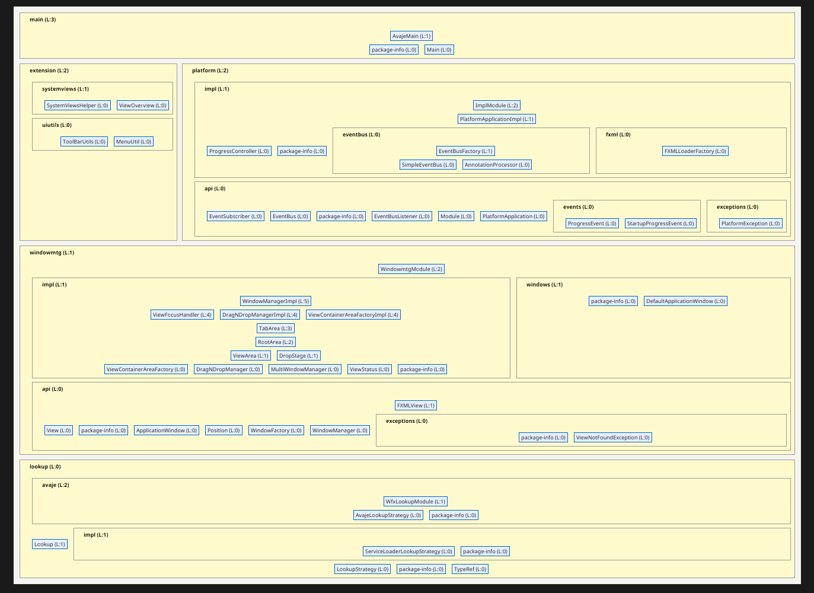

# WFX - Window Framework for JavaFX

[](https://openjdk.org/)
[](https://openjfx.io/)
[](LICENSE.txt)

WFX is a lightweight rich client platform for JavaFX applications. Inspired by
the NetBeans RCP, it provides workbench-style features: tab views, splittable
areas, drag-and-drop docking, a startup preloader, module discovery, and a
synchronous in-process event bus.

## Features

- **Window Management** - tab-based views with drag & drop, splittable areas, and registration-order independent layouts
- **View Lifecycle** - every view declares its kind via `ViewKind` (`TOOL` or `DOCUMENT`); close, `restoreDefaultLayout()`, and the auto-built View menu all follow that classification
- **Auto-built View menu** - optional `view-menu` extension adds a top-level View entry per registered TOOL view, kept in sync with the registry
- **Application Window** - `DefaultApplicationWindow` ships with menu, tool, and status bar slots ready to be populated; can be subclassed for a custom shell
- **Module System** - modules discovered via Avaje Inject or Java `ServiceLoader`
- **Optional Priority** - modules can declare `@Priority` to control startup order
- **Preloader** - splash window shown while modules run their `preload()` work, with progress events on the platform event bus
- **Bootstrapping Support** - clear `init` → preloader → `preload()` → main window → `start()` lifecycle so expensive work happens at the right phase
- **Event Bus** - synchronous in-process bus with type-hierarchy dispatch and `@EventSubscriber` auto-wiring
- **Lookup** - service-locator boundary with pluggable strategies (Avaje / ServiceLoader); used at framework edges, not for domain logic
- **Avaje Inject Integration** - compile-time DI for framework infrastructure
- **ServiceLoader Support** - lightweight non-DI fallback for simple applications and tests
- **FXML Integration** - `FXMLView.Builder` ties FXML files to controllers and registration metadata

## Architecture



## Requirements

- **Java 21** or higher
- **JavaFX 21** or higher
- **Maven 3.8+** for building

## Quick Start

### Building the Project

```bash
mvn clean install -DskipTests
```

### Running the Example Application

```bash
mvn -pl wfx-modules/example-gui exec:java
```

This starts `io.softwareecg.wfx.examplegui.ExampleAvajeMain`.

## Project Structure

| Module | Description |
|--------|-------------|
| `wfx-modules/lookup` | Core lookup / service-locator API |
| `wfx-modules/lookup-avaje` | Avaje-backed lookup implementation |
| `wfx-modules/platform-api` | Platform API interfaces (`Module`, `EventBus`, ...) |
| `wfx-modules/platform-core` | Platform core implementation |
| `wfx-modules/platform-runner` | Application launcher and lifecycle (`Main`, `AvajeMain`) |
| `wfx-modules/windowmanager-api` | Window-management API (`WindowManager`, `View`, `Position`) |
| `wfx-modules/windowmanager-core` | Window-management implementation (split areas, drag & drop) |
| `wfx-modules/extensions/ui-utils` | UI utility classes (menu/toolbar helpers, system views) |
| `wfx-modules/extensions/view-menu` | Optional auto-built top-level View menu listing every registered TOOL view |
| `wfx-modules/example-gui` | Example application demonstrating the framework |
| `wfx-all` | All-in-One JAR with all WFX modules bundled |

## Maven Dependency

The easiest way to use WFX is the `wfx-all` aggregator dependency:

```xml
<dependency>
    <groupId>io.softwareecg.wfx</groupId>
    <artifactId>wfx-all</artifactId>
    <version>7.0.0-SNAPSHOT</version>
</dependency>
```

This dependency provides the WFX modules, JavaFX FXML/Controls, Avaje Inject,
SLF4J, Logback, and Apache Commons Lang3.

If you prefer to pick individual modules, add them separately, for example
`lookup`, `lookup-avaje`, `platform-runner`, and `windowmanager-core`.

## Creating a Simple Application

A minimal WFX application has four pieces: a launcher class, an
`ApplicationWindow` that hosts the menu/tool bars and the docking area, one
or more views (FXML + controller), and one or more `Module`s that register
those views at a `Position`.

### 1. Create a Main Class

Use `AvajeMain` when the application uses Avaje-managed WFX infrastructure:

```java
import io.softwareecg.wfx.main.AvajeMain;
import javafx.application.Application;

public class MyApp extends AvajeMain {
    public static void main(String[] args) {
        Application.launch(MyApp.class, args);
    }
}
```

Use `Main` only for a pure `ServiceLoader` setup.

### 2. Define an Application Window

WFX needs exactly one `ApplicationWindow` bean. Every application picks it up
explicitly — there is no auto-registered fallback, on purpose. The simplest
form is an empty subclass of `DefaultApplicationWindow` with `@Singleton`:

```java
import io.softwareecg.wfx.windowmtg.windows.DefaultApplicationWindow;
import jakarta.inject.Singleton;

@Singleton
public class MyApplicationWindow extends DefaultApplicationWindow {
}
```

That's it. `DefaultApplicationWindow` already carries the FXML scene with
menu bar, tool bar and status bar. WFX's `PlatformApplicationImpl` finds the
bean, calls `setStage(...)`, `setWindowManager(...)`, `init()`, and then
`stage.show()`. The customization story (own FXML, branded shell) follows in
step 5.

### 3. Build a View (FXML + Controller)

A WFX view is a JavaFX scene loaded from an FXML file together with a
controller class. The controller carries the per-view state and event
handlers; the FXML wires UI elements to it via `fx:controller` and `@FXML`.

A minimal controller:

```java
import javafx.fxml.FXML;
import javafx.scene.control.Button;
import javafx.scene.control.Label;

public class MyController {

    @FXML
    private Label messageLabel;

    @FXML
    private Button refreshButton;

    @FXML
    public void initialize() {
        messageLabel.setText("Hello WFX");
        refreshButton.setOnAction(e -> messageLabel.setText("Refreshed."));
    }
}
```

Matching `my-view.fxml`, placed next to the controller on the classpath:

```xml
<?xml version="1.0" encoding="UTF-8"?>
<?import javafx.scene.control.*?>
<?import javafx.scene.layout.*?>

<VBox xmlns:fx="http://javafx.com/fxml"
      fx:controller="com.example.MyController"
      spacing="10" style="-fx-padding: 12;">
    <Label fx:id="messageLabel" />
    <Button fx:id="refreshButton" text="Refresh" />
</VBox>
```

The controller is constructed by JavaFX's `FXMLLoader`. WFX hooks the loader
into the active `Lookup` strategy (Avaje by default), so a controller can
constructor-inject managed beans if it needs any. A controller with no
dependencies — like the one above — is simply instantiated via
`newInstance()`; no annotations required.

If the controller does need DI and should be created fresh per FXML load,
mark it `@Prototype`. Use `@Singleton` only when there is genuinely one
controller for the whole application (rare for views).

### 4. Register the View at a Position

Modules register views with the `WindowManager`. The `Position` enum
(`TOP`, `LEFT`, `CENTER`, `RIGHT`, `BOTTOM`) decides where the view docks
inside the application window's central area.

```java
import io.softwareecg.wfx.lookup.Lookup;
import io.softwareecg.wfx.platform.api.Module;
import io.softwareecg.wfx.platform.api.exceptions.PlatformException;
import io.softwareecg.wfx.windowmtg.api.FXMLView;
import io.softwareecg.wfx.windowmtg.api.Position;
import io.softwareecg.wfx.windowmtg.api.WindowManager;
import jakarta.inject.Singleton;

import java.io.IOException;

@Singleton
public class MyModule implements Module {

    @Override
    public void preload() throws PlatformException {
        try {
            FXMLView<MyController> view = new FXMLView.Builder<MyController>()
                    .withId("my-view")
                    .withTitle("My View")
                    .withPos(Position.CENTER)         // try LEFT/RIGHT/TOP/BOTTOM
                    .withFile(getClass().getResource("my-view.fxml"))
                    .build();
            Lookup.lookup(WindowManager.class).register(view);
        } catch (IOException e) {
            throw new PlatformException(e);
        }
    }

    @Override
    public void start() { /* called on FX thread after main window is shown */ }

    @Override
    public void stop()  { /* called on application shutdown */ }
}
```

`FXMLView.Builder` binds the FXML file from step 3 to its controller class
and adds the registration metadata (id, title, dock position) the
`WindowManager` needs.

**Tool vs document views.** Every view has a `ViewKind`. The default
`TOOL` describes a persistent panel — closing its tab hides the view but
keeps it in the registry, `WindowManager.restoreDefaultLayout()` brings
it back, and the auto-built View menu (see "Recipes") lists it. For
transient, content-bound views (per-document editors, per-JAR charts,
query results …) declare the kind explicitly so closing the tab fully
unregisters the view and `restoreDefaultLayout()` drops it:

```java
FXMLView<EditorController> editor = new FXMLView.Builder<EditorController>()
        .withId("editor-" + fileId)
        .withTitle(file.getName())
        .withPos(Position.CENTER)
        .withKind(ViewKind.DOCUMENT)
        .withFile(getClass().getResource("editor.fxml"))
        .build();
```

`preload()` is invoked by WFX on every discovered module after the preloader
becomes visible, on a background thread. Each call advances the preloader's
progress bar and emits a `StartupProgressEvent` (with the module's
`getName()`) on the platform event bus, so users see the application warming
up instead of a blank window. Long-running setup — building views, opening
local data sources, fetching cached configuration — belongs here. UI work
that needs the main window (menu binding, dock-area registrations the user
should see immediately) belongs in `start()`, which runs on the JavaFX
Application Thread after the main window is shown.

### 5. Customize the Application Window (optional)

If you want a custom shell — a different FXML, a different layout, a custom
icon, a branded title bar — override `init()` on your `ApplicationWindow`
subclass and load your own FXML:

```java
import io.softwareecg.wfx.lookup.Lookup;
import io.softwareecg.wfx.windowmtg.windows.DefaultApplicationWindow;
import jakarta.inject.Singleton;
import javafx.fxml.FXMLLoader;
import javafx.scene.Parent;
import javafx.scene.Scene;
import javafx.scene.layout.BorderPane;

import java.io.IOException;

@Singleton
public class MyApplicationWindow extends DefaultApplicationWindow {

    @javafx.fxml.FXML
    private BorderPane root;

    @Override
    public void init() throws IOException {
        FXMLLoader loader = Lookup.lookup(FXMLLoader.class);
        loader.setLocation(getClass().getResource("MyApplicationWindow.fxml"));
        loader.setController(this);

        Parent scene = loader.load();
        getStage().setScene(new Scene(scene));
        getStage().setMaximized(true);

        // Hand the WFX docking area into the layout.
        root.setCenter(getWindowManager().getRootPane());

        useSystemMenuBarIfPossible();
    }
}
```

The matching `MyApplicationWindow.fxml` only needs to wire the IDs that
`DefaultApplicationWindow` expects (`menuBar`, `toolbar`, `statusBar`) and a
container that the central docking area can be plugged into:

```xml
<?xml version="1.0" encoding="UTF-8"?>
<?import javafx.scene.control.*?>
<?import javafx.scene.layout.*?>

<BorderPane fx:id="root" xmlns:fx="http://javafx.com/fxml">
    <top>
        <VBox>
            <MenuBar fx:id="menuBar">
                <Menu text="File">
                    <MenuItem text="Exit" />
                </Menu>
            </MenuBar>
            <ToolBar fx:id="toolbar" />
        </VBox>
    </top>
    <bottom>
        <HBox fx:id="statusBar" />
    </bottom>
</BorderPane>
```

`getWindowManager().getRootPane()` is set as the `BorderPane`'s center at
runtime — that is the area where module-registered views appear.

### 6. Subscribe to and Fire Events

WFX exposes a synchronous in-process `EventBus<EventObject>` via `Lookup`.
Modules, controllers, and items use it to communicate without depending on
each other directly.

A custom event extends `EventObject`:

```java
import java.util.EventObject;

public class GreetingEvent extends EventObject {

    private final String message;

    public GreetingEvent(Object source, String message) {
        super(source);
        this.message = message;
    }

    public String getMessage() {
        return message;
    }
}
```

Firing the event from anywhere that has access to `Lookup`:

```java
import io.softwareecg.wfx.lookup.Lookup;
import io.softwareecg.wfx.platform.api.EventBus;

EventBus<EventObject> bus = Lookup.lookup(EventBus.class);
bus.publish(new GreetingEvent(this, "Hello from MyModule"));
```

Subscribing — two ways. The explicit lambda form, suitable everywhere:

```java
Lookup.lookup(EventBus.class).subscribe(GreetingEvent.class, event -> {
    System.out.println(event.getMessage());
    return true;   // false marks the event as not handled
});
```

Or the annotation form on a class:

```java
import io.softwareecg.wfx.platform.api.EventSubscriber;

public class MyController {

    @EventSubscriber(eventClass = GreetingEvent.class)
    public boolean handleGreeting(GreetingEvent event) {
        System.out.println(event.getMessage());
        return true;
    }
}
```

`@EventSubscriber` methods are wired automatically when the annotated
instance is created by `FXMLLoader` (i.e. the FXML controller path). For
beans that are not loaded through FXML, call
`AnnotationProcessor.process(this)` once after construction to register
their handlers.

Listeners run synchronously on the publishing thread. If a handler needs to
touch the UI, switch to the JavaFX thread itself with `Platform.runLater`.

Event types are matched along the class hierarchy — a listener for the
parent type also receives subclass events.

### 7. Follow the WFX DI Boundary

WFX uses DI for long-lived infrastructure:

- platform services
- modules
- event bus
- window manager
- application windows
- factories

Concrete `FXMLView` instances are runtime registration objects and should be
created explicitly. FXML controllers are not singletons by default; annotate
them only when they really need DI-managed dependencies. Use `@Prototype` for
controllers that must be created fresh per FXML load.

### Optional: Declare a Startup Order

Module discovery order is not specified. If your module must run before or
after others, declare a `@Priority`:

```java
import jakarta.annotation.Priority;
import jakarta.inject.Singleton;

@Singleton
@Priority(1000)   // smaller value = earlier; default is Integer.MAX_VALUE
public class MySidebarModule implements Module { ... }
```

## Application Lifecycle

WFX has four phases. Knowing where each phase runs and what the platform
does between them is what makes the difference between a slow black
window and a clean splash-then-main-window startup.

```
   Application.launch(MyApp.class)
              │
              ▼
   showPreloader(stage)               ◄── splash window appears
              │
              ▼
   discover Module beans (Avaje | ServiceLoader)
   sort by @Priority (lower = earlier)
              │
              ▼  for each module — background thread, sequential
   ┌─ module.preload() ─────────────────────┐
   │   long setup, load data,               │── publishes
   │   build FXML views,                    │   StartupProgressEvent
   │   register with WindowManager          │   → splash bar advances
   └────────────────────────────────────────┘
              │
              ▼
   hidePreloader()
   showMainApplicationWindow(stage)   ◄── main window appears
   windowManager.init()
              │
              ▼  for each module — FX thread, order unspecified
   module.start()                     ◄── wire menus, focus initial view
              │
              ▼
   ─── application running ───
              │
              ▼  user closes window
   module.stop()                      ◄── cleanup, persist state
```

**`preload()`** runs on a background thread before the main window
exists. Anything that takes time — opening a database, scanning the
classpath, building view trees — belongs here. Each call advances the
preloader.

**`start()`** runs on the JavaFX Application Thread *after* the main
window is shown. Use it for work that needs the live menu/toolbar/dock
area: binding menu items, focusing an initial view, registering UI-side
event subscribers.

**`stop()`** runs on shutdown. Persist user state, close resources,
unsubscribe long-lived listeners.

## Recipes

### Custom splash screen

The default splash lives in `platform-core` at `/default/splash.fxml`.
WFX checks for an application-specific override at `/splash/splash.fxml`
on the classpath first. To replace the splash, drop a
`src/main/resources/splash/splash.fxml` into your application module and
keep `ProgressController` as its `fx:controller`:

```xml
<?xml version="1.0" encoding="UTF-8"?>
<?import javafx.scene.control.Label?>
<?import javafx.scene.control.ProgressBar?>
<?import javafx.scene.image.Image?>
<?import javafx.scene.image.ImageView?>
<?import javafx.scene.layout.Pane?>

<Pane prefHeight="300" prefWidth="500" xmlns:fx="http://javafx.com/fxml"
      fx:controller="io.softwareecg.wfx.platform.impl.ProgressController">
    <ImageView fitHeight="300" fitWidth="500">
        <Image url="@my-splash.png" preserveRatio="true"/>
    </ImageView>
    <ProgressBar fx:id="progressBar" layoutX="20" layoutY="260" prefWidth="460"/>
    <Label fx:id="progressText" layoutX="20" layoutY="270" prefWidth="460"/>
</Pane>
```

The `progressBar` and `progressText` IDs are required — the controller
binds them to the `StartupProgressEvent` stream.

A future 1.1 release will add a `SplashConfig.builder()` so you do not
have to write FXML at all for simple branding overrides.

### Replacing the built-in status bar

`DefaultApplicationWindow.fxml` includes a small progress bar/label in
the status bar via `<fx:include source="StatusBarProgress.fxml"/>`. The
included controller subscribes to `ProgressEvent` on the event bus, so
any module that publishes one updates the status bar.

To replace it — for example with a custom user/connection indicator —
override the application window with your own FXML and either drop the
include or replace it with your own component:

```java
@Singleton
public class MyApplicationWindow extends DefaultApplicationWindow {

    @javafx.fxml.FXML
    private BorderPane root;

    @Override
    public void init() throws IOException {
        FXMLLoader loader = Lookup.lookup(FXMLLoader.class);
        loader.setLocation(getClass().getResource("MyApplicationWindow.fxml"));
        loader.setController(this);
        Parent scene = loader.load();
        getStage().setScene(new Scene(scene));
        root.setCenter(getWindowManager().getRootPane());
        useSystemMenuBarIfPossible();
    }
}
```

Your `MyApplicationWindow.fxml` keeps the `menuBar` / `toolbar` /
`statusBar` ids that `DefaultApplicationWindow` expects, but populates
the `<HBox fx:id="statusBar">` with whatever you want.

### Programmatic views without FXML

Most views are FXML + controller via `FXMLView.Builder`. When a view is
small enough that an FXML file is overkill — a stub, a generated chart,
a third-party node — implement `View` directly:

```java
public class MyProgrammaticView implements View {

    private final BorderPane root;

    public MyProgrammaticView() {
        Label label = new Label("Hello from a programmatic view");
        root = new BorderPane(label);
    }

    @Override public String getViewId()           { return "my-prog-view"; }
    @Override public String getTitle()            { return "Programmatic"; }
    @Override public String getToolTipInfo()      { return null; }
    @Override public Position getDefaultPosition(){ return Position.CENTER; }
    @Override public Parent getRootNode()         { return root; }
    @Override public double getViewAreaSize()     { return 0.5; }
}
```

Then register it like any other view:

```java
Lookup.lookup(WindowManager.class).register(new MyProgrammaticView());
```

A future 1.1 release will add a `SimpleView.Builder` that condenses the
six-method boilerplate into a fluent builder call.

### Auto-built View menu

The `view-menu` extension adds a top-level **View** menu to the
application window with one entry per registered `ViewKind.TOOL` view,
in registration order. Clicking an entry shows the view — re-displaying
it when the user has previously closed its tab (a TOOL close hides, it
does not unregister) and focusing it when it is already visible.
`DOCUMENT` views never appear in the menu by design.

Add the runtime dependency to the module that bundles your application
(typically the one with your `Main` class):

```xml
<dependency>
    <groupId>io.softwareecg.wfx</groupId>
    <artifactId>view-menu</artifactId>
    <version>7.0.0-SNAPSHOT</version>
    <scope>runtime</scope>
</dependency>
```

That is all the wiring required. Avaje discovers the `@Singleton`
`ViewMenuModule` automatically, the module runs at `@Priority(50)`
(after default-view-registering modules), reads the tool-view registry
once on `start()`, and then keeps the menu in sync with later
registrations through a `ListChangeListener` on
`WindowManager.getToolViews()`.

If the application already declares a `View` menu (e.g. for app-
specific items that should sit alongside the auto-generated entries)
the extension reuses it rather than creating a duplicate. Items have
stable ids of the form `view.<viewId>` so other code can find or
remove them via `MenuUtil.findItem`.

| Action | TOOL view | DOCUMENT view |
|---|---|---|
| Close the tab (X button) | hide; stay in registry, View menu, layout-restore | unregister; gone |
| `WindowManager.unregister(view)` | remove from registry **and** View menu | same as close |
| `WindowManager.restoreDefaultLayout()` | re-show in default position, even if currently closed | drop |
| Auto View menu entry | yes | no |

### Cross-module communication via the event bus

Two modules that do not depend on each other can still cooperate
through the platform event bus. The event type is the only contract.

A producer module loads data and announces it:

```java
public final class DataLoadedEvent extends EventObject {
    private final List<Record> records;

    public DataLoadedEvent(Object source, List<Record> records) {
        super(source);
        this.records = records;
    }

    public List<Record> records() { return records; }
}

@Singleton
@Priority(100)
public class DataModule implements Module {

    @Override
    public void preload() throws PlatformException {
        List<Record> records = loadFromDatabase();   // long-running
        EventBus<EventObject> bus = Lookup.lookup(EventBus.class);
        bus.publish(new DataLoadedEvent(this, records));
    }
    @Override public void start() { }
    @Override public void stop()  { }
}
```

A consumer module — registered independently, possibly in another
artifact — subscribes during `preload()` and reacts whenever data
arrives, including data published before its own subscription if the
producer keeps the latest event around (the bus itself does not):

```java
@Singleton
@Priority(200)   // runs after DataModule
public class ChartModule implements Module {

    @Override
    public void preload() {
        EventBus<EventObject> bus = Lookup.lookup(EventBus.class);
        bus.subscribe(DataLoadedEvent.class, e -> {
            Platform.runLater(() -> rebuildChart(e.records()));
            return true;
        });
    }
    @Override public void start() { }
    @Override public void stop()  { }
}
```

Two notes:

- The bus is **synchronous**: the publishing thread runs every
  subscriber inline. If a handler touches the UI, switch to the FX
  thread itself with `Platform.runLater`.
- **Subscribe before publish.** If `ChartModule` subscribes after
  `DataModule` publishes, it misses the event. Use `@Priority` to order
  modules — or have the producer hold the most recent event and replay
  it for late subscribers.

## Dependencies

The framework uses:

- **Avaje Inject 11.x** - compile-time dependency injection
- **SLF4J 2.0.x** + **Logback 1.5.x** - logging
- **JavaFX 21** - UI framework
- **JUnit 4.13** + **Mockito 5.7** - test stack

## License

This project is licensed under the Apache License 2.0 - see the [LICENSE.txt](LICENSE.txt) file for details.

## Contributing

Contributions are welcome. Please feel free to submit a Pull Request.

## History

This project was originally developed as "wfx" at Weigend AM and has been
modernised to support Java 21. Package namespaces were renamed from
`de.weigend.*` to `io.softwareecg.*` during the rebrand.
